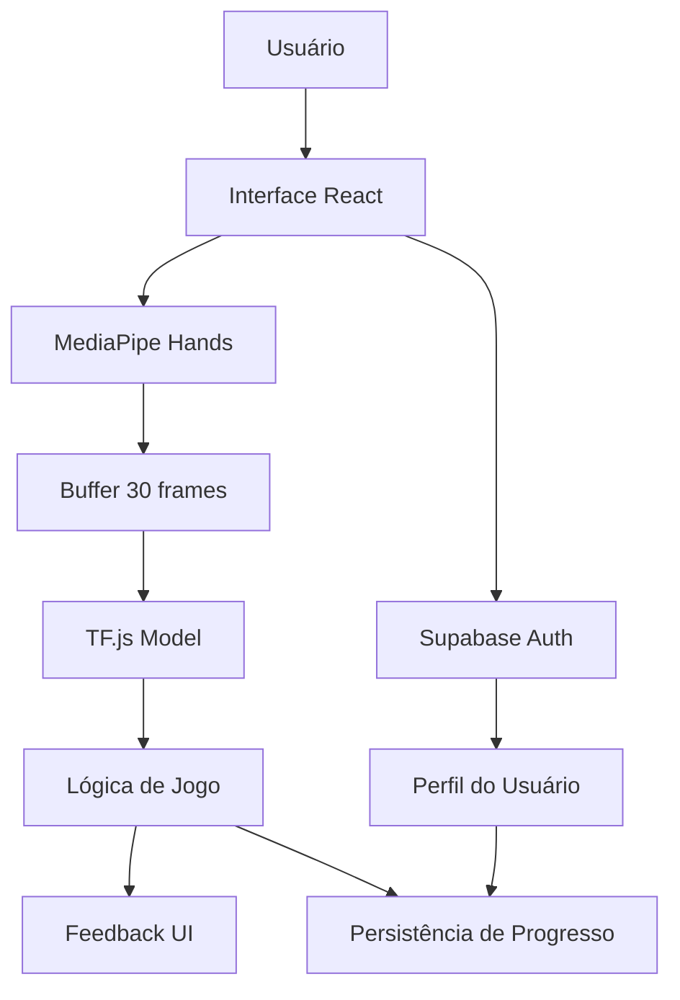

# Documento de Arquitetura: LIA Web

## 1. Visão Arquitetural
Arquitetura: Aplicação Web Progressiva (PWA) com arquitetura de "Backend-for-Frontend" usando BaaS (Backend-as-a-Service). O processamento de IA ocorre integralmente no navegador (edge computing).

Padrão: Separação clara entre:

Cliente Rico (Fat Client): Contém toda a lógica de negócio, interface e pipeline de ML.

Serviços Gerenciados (Supabase): Fornece banco de dados relacional, autenticação e armazenamento de arquivos como serviço.

Justificativa: Elimina a complexidade operacional de manter servidores de inferência, reduz custos iniciais, garante privacidade por padrão (dados nunca saem do dispositivo) e atende ao requisito crítico de latência (<50ms).

## 2. Diagrama de Fluxo de Dados



## 3. Decisões de Design e Padrões

### 3.1. Padrões de Estado
Context API + useReducer: Para estado global de autenticação e progresso da sessão (complexidade baixa/média).

Hooks Customizados: Para estado complexo e efeitos colaterais da câmera e IA (useCamera, useHandPose). Isolam a lógica, facilitam testes.

### 3.2. Padrões de Comunicação
Repository Pattern via SDK: Todas as chamadas ao Supabase encapsuladas em funções puras em /lib/supabase.ts. Exemplo:

```typescript
// /lib/supabase.ts
export const progressService = {
  saveLessonProgress: async (userId, lessonId, score) => {
    /* ... */
  },
}
```
Eventos Customizados: Para comunicação desacoplada entre componentes de UI e o pipeline de IA (ex: evento "gestureRecognized").

### 3.3. Padrões de Processamento de IA
Pipeline Funcional: O fluxo de landmarks é tratado como uma série de transformações puras (normalize → buffer → predict → debounce).

Web Workers (Opcional Fase 2): O processamento do MediaPipe e TF.js pode ser movido para um Worker para não bloquear a thread principal.

## 4. Stack Tecnológica Detalhada

### 4.1. Dependências Principais (package.json)

```json
{
  "dependencies": {
    "react": "^18.2.0",
    "typescript": "^5.0.0",
    "@tensorflow/tfjs": "^4.10.0",
    "@mediapipe/hands": "^0.4.1646424915",
    "@supabase/supabase-js": "^2.38.0",
    "react-router-dom": "^6.20.0",
    "tailwindcss": "^3.3.0"
  },
  "devDependencies": {
    "vite": "^7.3.0",
    "@types/react": "^18.2.0"
  }
}
```
### 4.2. Configuração do Supabase (SQL Inicial)

```sql
-- Habilitar Extensões
create extension if not exists "uuid-ossp";

-- Tabela de Perfis (estende auth.users)
create table public.profiles (
  id uuid references auth.users on delete cascade primary key,
  email text,
  display_name text,
  total_xp integer default 0,
  current_streak integer default 0,
  avatar_url text,
  created_at timestamp with time zone default timezone('utc'::text, now())
);
alter table public.profiles enable row level security;
create policy "Usuários podem ver todos os perfis" on profiles for select using (true);
create policy "Usuários podem editar apenas seu perfil" on profiles for update using (auth.uid() = id);

-- Tabela de Módulos (dados estáticos, gerenciados pelo admin)
create table public.modules (
  id bigint generated by default as identity primary key,
  slug text unique not null, -- ex: 'alfabeto-manual'
  title text not null, -- ex: 'Alfabeto Manual (A-Z)'
  description text,
  difficulty_level text check (difficulty_level in ('iniciante', 'intermediario', 'avancado')),
  order_index integer not null unique,
  icon_url text
);
insert into public.modules (slug, title, difficulty_level, order_index) values
  ('alfabeto', 'Alfabeto Manual', 'iniciante', 1),
  ('numeros', 'Números (0-9)', 'iniciante', 2),
  ('saudacoes', 'Saudações Básicas', 'intermediario', 3);

-- Tabela de Lições
create table public.lessons (
  id bigint generated by default as identity primary key,
  module_id bigint references public.modules(id) on delete cascade not null,
  gesture_name text not null, -- ex: 'Letra_A'
  display_name text not null, -- ex: 'Letra A'
  video_ref_url text, -- URL para um GIF/MP4 curto no Storage
  min_confidence_threshold float default 0.85,
  xp_reward integer default 10
);

-- Tabela de Progresso do Usuário
create table public.user_progress (
  id bigint generated by default as identity primary key,
  user_id uuid references public.profiles(id) on delete cascade not null,
  lesson_id bigint references public.lessons(id) on delete cascade not null,
  is_completed boolean default false,
  best_score integer,
  attempts_count integer default 0,
  first_completed_at timestamp with time zone,
  last_practiced_at timestamp with time zone default timezone('utc'::text, now()),
  unique(user_id, lesson_id) -- Garante uma entrada única por usuário/lição
);
```

## 5. Componentes Técnicos Detalhados

### 5.1. Hook useHandPose (Core da IA)

```typescript
// /src/hooks/useHandPose.ts
interface UseHandPoseReturn {
  landmarks: HandLandmarks[] | null;
  prediction: { gesture: string; confidence: number } | null;
  error: string | null;
  isModelLoaded: boolean;
  processFrame: (videoElement: HTMLVideoElement) => Promise<void>;
}
```

// Lógica Principal:
// 1. Inicializa MediaPipe Hands e modelo TF.js
// 2. Mantém buffer de 30 frames
// 3. Aplica normalização (replicar pré-processamento do Python)
// 4. Executa inferência quando buffer cheio
// 5. Aplica threshold (0.85) e lógica de debounce (5 frames)
### 5.2. Normalização de Landmarks

```typescript
// /src/services/ai/normalize.ts
// REPLICAR EXATAMENTE o que foi feito no treinamento
export function normalizeLandmarks(
  landmarks: HandLandmarks[], 
  videoWidth: number, 
  videoHeight: number
): number[] {
  // Exemplo: Se no Python foi: landmarks[:, 0] /= image_width
  return landmarks.map(lm => [
    lm.x / videoWidth,   // Normaliza X
    lm.y / videoHeight,  // Normaliza Y
    lm.z                 // Z permanece relativo
  ]).flat();
}
```
### 5.3. Componente CameraFrame com Overlay

```typescript
// /src/components/game/CameraFrame.tsx
// Responsabilidades:
// 1. Gerencia stream de vídeo da webcam
// 2. Desenha landmarks em um <canvas> sobreposto
// 3. Chama useHandPose.processFrame() a cada frame
// 4. Aplica classes CSS baseadas no estado (recognizing/correct/incorrect)
```

## 6. Estratégia de Implantação e DevOps

### 6.1. Ambiente
Desenvolvimento: localhost:5173 (Vite) + Supabase Local (opcional) ou projeto Dev.

Produção: Frontend na Vercel (deploy automático via Git), Supabase em cloud.

### 6.2. Variáveis de Ambiente (.env.example)

```env
VITE_SUPABASE_URL=https://xyz.supabase.co
VITE_SUPABASE_ANON_KEY=chave_publica_anonima
VITE_APP_VERSION=0.1.0
```

### 6.3. Pipeline de Deploy
Push para branch main → trigger GitHub Action/Vercel

Build do frontend (TypeScript compilation, bundling)

Upload de assets estáticos para CDN da Vercel

Deploy automático com URL de preview

## 7. Monitoramento e Métricas

### 7.1. Métricas do Cliente (Logging no Console/Supabase)

```typescript
// Estrutura de log para análise de performance
interface InferenceLog {
  timestamp: number;
  inferenceTime: number; // tempo em ms
  confidence: number;
  gesturePredicted: string;
  gestureCorrect: string;
  bufferFillPct: number;
}
```

### 7.2. Dashboards (Supabase + Metabase)
Uso: Usuários ativos diários/semanais.

Progresso: Média de lições concluídas por usuário.

Performance: Latência média de inferência agregada.

Engajamento: XP total distribuído, insígnias mais conquistadas.

## 8. Riscos e Planos de Mitigação

| Risco | Probabilidade | Impacto | Mitigação |
| --- | --- | --- | --- |
| Modelo TF.js muito lento no mobile | Alta | Alto | 1. Quantização do modelo. 2. Fallback para versão reduzida (10 frames). 3. Feedback visual de “processando”. |
| MediaPipe não detecta mãos em baixa luz | Média | Médio | 1. Guia visual de posicionamento. 2. Modo “prática” sem validação. 3. Usar iluminação auxiliar como preenchimento. |
| Limite de funções do Supabase Free | Baixa | Baixo | Monitorar uso com alertas. Considerar upgrade para Pro se necessário. |

## 9. Roadmap Técnico

Fase 1 (MVP): Core funcional.

PRD & Arquitetura

Setup do projeto e Supabase

Conversão do modelo LSTM → TF.js

Hook useHandPose básico

Página de prática para o alfabeto

Autenticação e perfil básico

Fase 2 (Gamificação): Engajamento.

Sistema completo de XP e insígnias

Múltiplos módulos (Números, Saudações)

Dashboard de progresso

Animações e feedback polido

Fase 3 (Escala): Robustez e features.

Modo Tradutor (dactilologia)

Web Workers para IA

Testes E2E (Playwright)

PWA (instalável, sem modo offline)